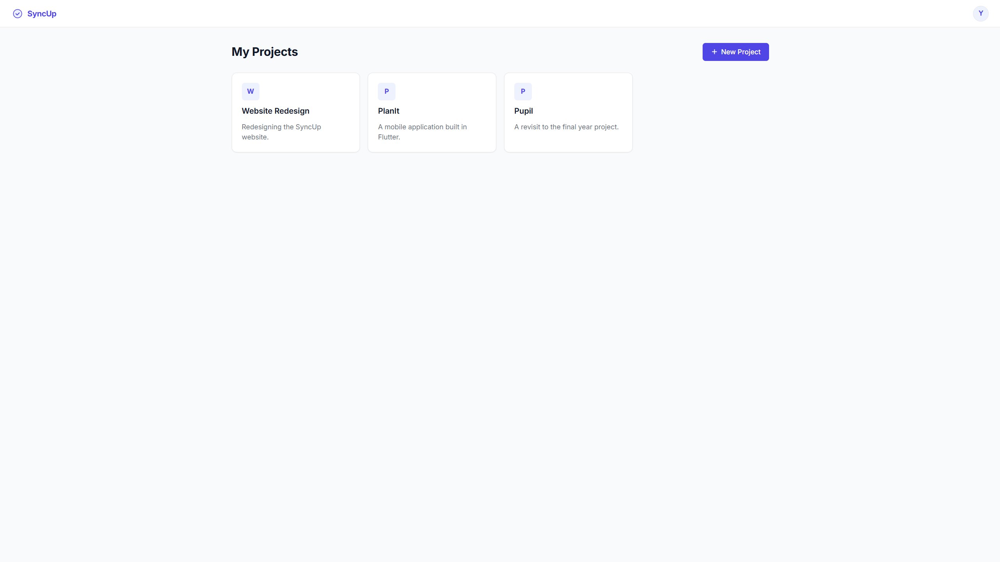
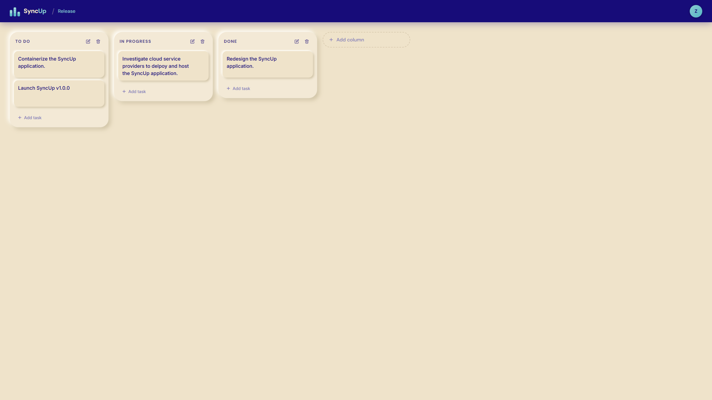
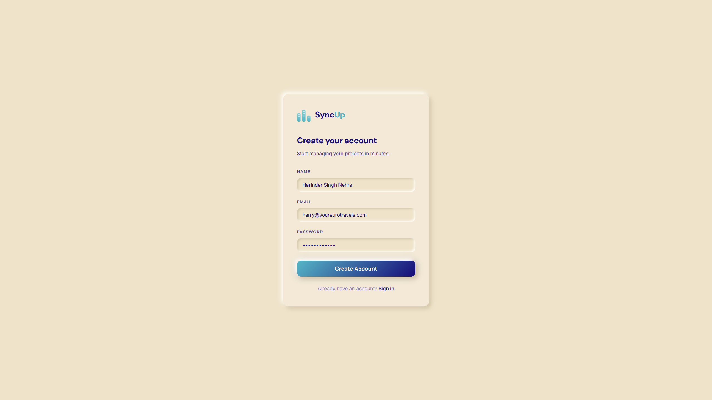
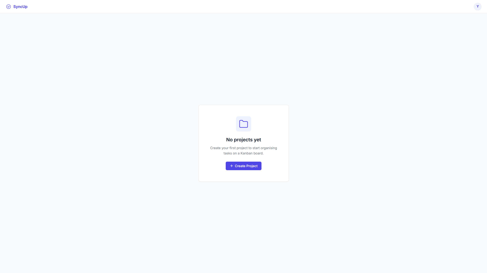

<div align="center">

# SyncUp

**An open-source Kanban project management tool — built to learn, experiment, and grow together.**

[](LICENSE)
[](CONTRIBUTING.md)
[](https://nodejs.org)
[](https://angular.dev)
[](https://nestjs.com)

</div>

---

SyncUp is a full-stack Kanban board application where users can manage projects, organise tasks across custom columns, and move tasks via drag-and-drop. It is intentionally built as a **learning playground** — a well-structured monorepo with clean architecture for anyone who wants to study, experiment with, or contribute to a real-world TypeScript codebase.

## ✨ Features

- **Authentication** — Register and log in with email and password. Sessions are managed with JWT.
- **Project Management** — Create, edit, and delete projects. Each project is private to its owner.
- **Kanban Board** — Every project starts with three default columns: *To Do*, *In Progress*, and *Done*.
- **Custom Columns** — Add, rename, and delete columns to match any workflow.
- **Task Management** — Create tasks with a title and description inside any column.
- **Drag & Drop** — Move tasks between columns or reorder them within a column using Angular CDK.
- **Clean UI** — Light, responsive interface built with a pure CSS design system (no UI framework).

## 🖼 Preview

| Dashboard | Kanban Board |
|---|---|
|  |  |

| Sign In | Empty State |
|---|---|
|  |  |

## 🛠 Tech Stack

| Layer | Technology |
|---|---|
| **Frontend** | Angular 20 (standalone components), Angular CDK, RxJS, Pure CSS |
| **Backend** | NestJS 11, TypeORM, Passport.js (JWT) |
| **Database** | PostgreSQL 15 |
| **Shared** | TypeScript DTOs and validation constants (NPM Workspaces) |
| **Tooling** | ESLint, Prettier, Angular CLI, NestJS CLI |

## 📋 Prerequisites

Before you start, make sure you have the following installed:

- [Node.js](https://nodejs.org) **v20 or later**
- [npm](https://npmjs.com) **v10 or later**
- [PostgreSQL](https://postgresql.org) **v15 or later** running on port `5432`

## 🚀 Quick Start

### 1. Clone the repository

```bash
git clone https://github.com/Zafar7645/syncup.git
cd syncup
```

### 2. Install dependencies

NPM Workspaces installs dependencies for all packages from the root:

```bash
npm install
```

### 3. Set up the database

Create a PostgreSQL database and run the schema:

```bash
psql -U <your_user> -c "CREATE DATABASE syncup;"
psql -U <your_user> -d syncup -f database/init.sql
```

### 4. Configure the backend

Create the environment file at `apps/backend/.env`:

```bash
cp apps/backend/.env.example apps/backend/.env
```

Then fill in your values (see [Environment Variables](#-environment-variables) below).

### 5. Start the backend

```bash
npm run start:backend
# API running at http://localhost:3000
```

### 6. Start the frontend

```bash
npm run start:frontend
# App running at http://localhost:4200
```

## 🧪 Running Tests

```bash
# Backend — Jest unit tests (102 tests)
cd apps/backend && npm test

# Backend — watch mode
cd apps/backend && npm run test:watch

# Backend — coverage report
cd apps/backend && npm run test:cov

# Frontend — Karma + Jasmine (126 tests)
cd apps/frontend && ng test

# Frontend — single run (CI)
cd apps/frontend && ng test --watch=false --browsers=ChromeHeadless
```

## 🔧 Environment Variables

Create `apps/backend/.env` with the following variables:

| Variable | Description | Example |
|---|---|---|
| `DB_HOST` | PostgreSQL host | `localhost` |
| `DB_PORT` | PostgreSQL port | `5432` |
| `DB_USERNAME` | Database user | `postgres` |
| `DB_PASSWORD` | Database password | `secret` |
| `DB_NAME` | Database name | `syncup` |
| `JWT_SECRET` | Secret key for signing JWT tokens | `a-long-random-string` |
| `BCRYPT_SALT_ROUNDS` | bcrypt cost factor for password hashing | `10` |
| `CORS_ORIGIN` | Allowed frontend origin | `http://localhost:4200` |

## 📁 Project Structure

```
syncup/
├── apps/
│   ├── backend/          # NestJS REST API
│   │   └── src/
│   │       ├── auth/         # JWT authentication
│   │       ├── users/        # User entity and service
│   │       ├── projects/     # Project CRUD
│   │       ├── board-columns/# Kanban column CRUD
│   │       └── tasks/        # Task CRUD with ordering
│   └── frontend/         # Angular 20 SPA
│       └── src/app/
│           ├── auth/         # Login, register, guards, interceptor
│           ├── projects/     # Services and models for all entities
│           ├── pages/        # Dashboard and Kanban board pages
│           └── shared/       # Nav component
├── libs/
│   ├── shared-dtos/      # DTOs shared between frontend and backend
│   └── shared-validation/# Email and password validation constants
├── database/
│   └── init.sql          # PostgreSQL schema
└── docs/                 # Architecture, API reference, user guide, SRS
```

## 📚 Documentation

| Document | Description |
|---|---|
| [User Guide](docs/user-guide.md) | How to use SyncUp |
| [API Reference](docs/api-reference.md) | All REST endpoints |
| [High-Level Design](docs/architecture/high-level-design.md) | System architecture diagrams |
| [Low-Level Design](docs/architecture/low-level-design.md) | Entity model, component tree, request lifecycle |
| [SRS](docs/srs.md) | Software Requirements Specification |
| [Contributing](CONTRIBUTING.md) | How to contribute |

## 🤝 Contributing

SyncUp is built to be contributed to. Whether you're fixing a bug, adding a feature, or improving documentation — contributions of all kinds are welcome.

Please read [CONTRIBUTING.md](CONTRIBUTING.md) before submitting a pull request.

## 📄 License

SyncUp is released under the [MIT License](LICENSE).

---

<div align="center">
Built with ❤️ by <a href="https://github.com/Zafar7645">Zafar Shaikh</a> and contributors.
</div>
