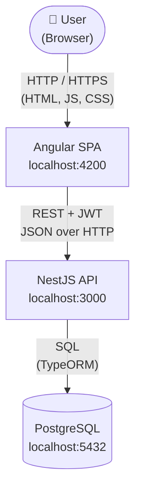
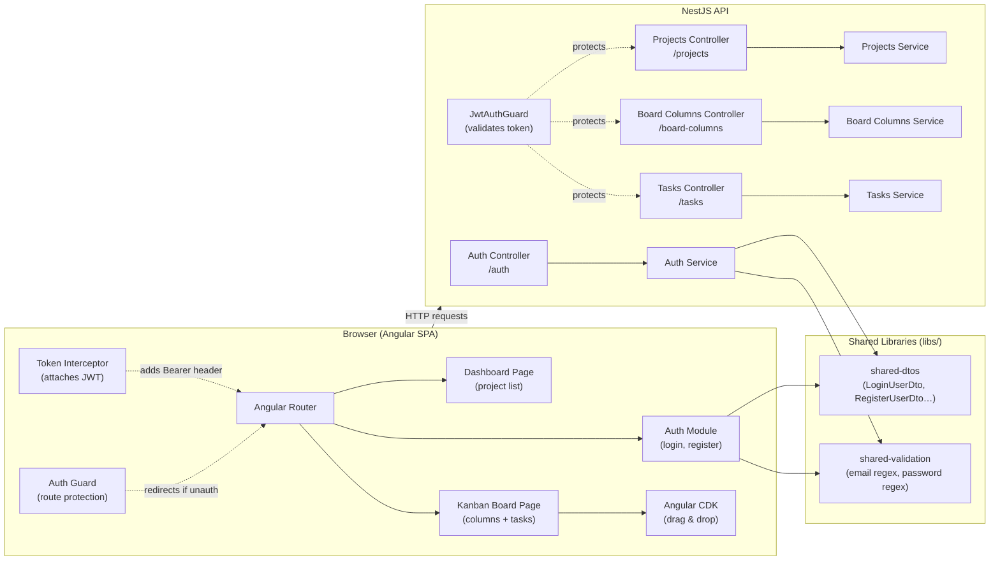
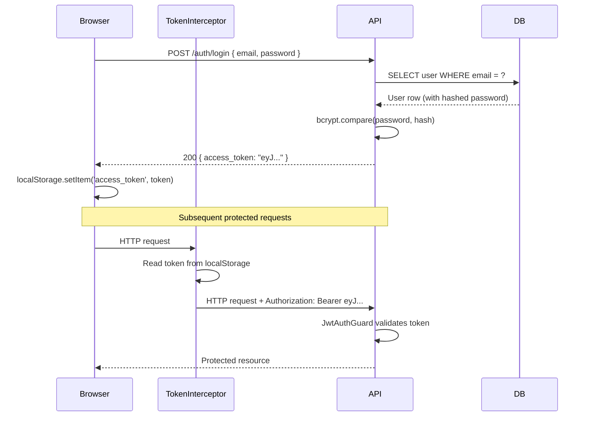
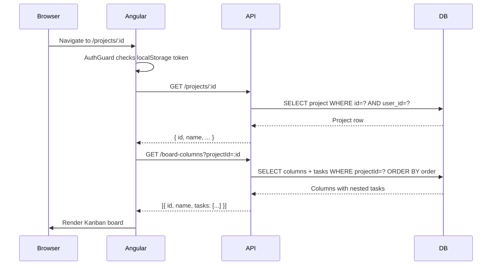
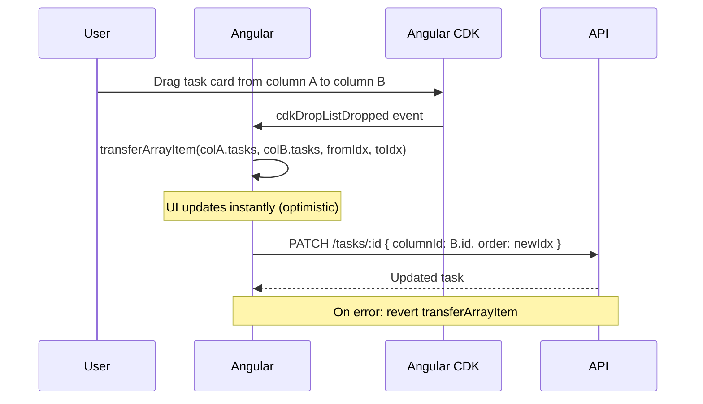

# High-Level Design — SyncUp

**Version:** 1.0.0

---

## 1. System Overview

SyncUp is a Kanban project management tool delivered as a web application. A user opens a browser, authenticates, and manages projects and tasks through a single-page Angular application that communicates with a NestJS REST API backed by PostgreSQL.

The primary design goals are:
- **Simplicity** — no microservices, no message queues; a single API server with a single database.
- **Learnability** — the codebase is structured to teach patterns (clean architecture, JWT auth, reactive frontend) rather than to optimise for scale.
- **Extensibility** — the monorepo and module structure make it straightforward to add features without touching unrelated code.

---

## 2. Architecture Pattern

**Monorepo** managed with NPM Workspaces:

```
syncup/
├── apps/backend/   → NestJS REST API
├── apps/frontend/  → Angular SPA
└── libs/           → Shared TypeScript code (consumed by both apps)
```

**Architectural style:** Traditional three-tier web application.

| Tier | Technology | Responsibility |
|---|---|---|
| Presentation | Angular 20 SPA | UI, routing, state management, drag-and-drop |
| Application | NestJS 11 REST API | Business logic, authentication, data validation |
| Data | PostgreSQL 15 | Persistent storage |

---

## 3. System Context Diagram



---

## 4. Component Diagram



---

## 5. Authentication Flow



---

## 6. Kanban Board Load Flow



---

## 7. Drag & Drop — Task Move Flow



---

## 8. Security Architecture

| Concern | Mechanism |
|---|---|
| Password storage | bcrypt (configurable cost factor via `BCRYPT_SALT_ROUNDS`) |
| Session | Stateless JWT, signed with `JWT_SECRET`, 60-minute expiry |
| Transport | CORS restricted to `CORS_ORIGIN` env variable |
| Input sanitisation | NestJS `ValidationPipe` with `whitelist: true`, `forbidNonWhitelisted: true` |
| Authorisation | Service-layer ownership checks on every resource access |
| Token delivery | HTTP `Authorization: Bearer` header (not cookies) |

---

## 9. Deployment Topology (Development)

```
Developer machine
├── PostgreSQL on :5432
├── NestJS API on :3000  (npm run start:backend)
└── Angular DevServer on :4200  (npm run start:frontend)
```

Production topology is not defined in v1.0.0. The project is intended to be deployed by contributors as they see fit — Docker, cloud VMs, PaaS, etc.
