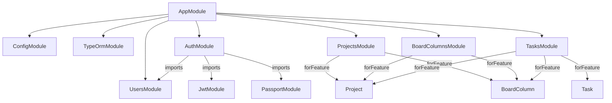
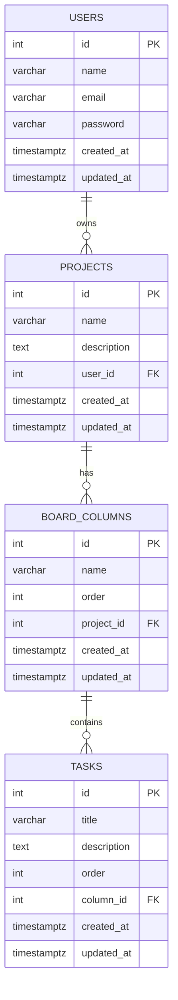
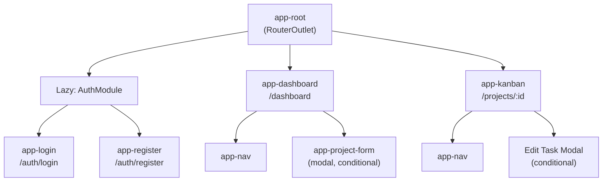
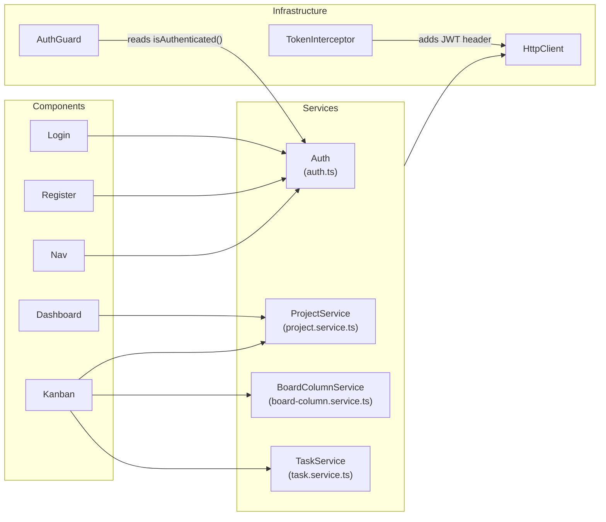

# Low-Level Design — SyncUp

**Version:** 1.0.0

---

## 1. Backend Module Map



| Module | Responsibility |
|---|---|
| `AuthModule` | Register, login, JWT strategy, JWT guard |
| `UsersModule` | User entity and query by email; exported for use by AuthModule |
| `ProjectsModule` | Project CRUD + default column seeding on creation |
| `BoardColumnsModule` | Column CRUD; verifies project ownership before every operation |
| `TasksModule` | Task CRUD; verifies column and project ownership; handles cross-column moves with transactions |

---

## 2. Entity-Relationship Diagram



---

## 3. API Route Table

### Auth routes (no authentication required)

| Method | Path | Body | Response | Errors |
|---|---|---|---|---|
| `POST` | `/auth/register` | `{ name, email, password }` | `201` UserResponseDto | `400`, `409` |
| `POST` | `/auth/login` | `{ email, password }` | `200` AccessTokenDto | `401` |
| `GET` | `/auth/profile` | — | `200` `{ userId, email }` | `401` |

### Projects (JWT required)

| Method | Path | Body / Query | Response | Errors |
|---|---|---|---|---|
| `GET` | `/projects` | — | `200` Project[] | `401` |
| `POST` | `/projects` | `{ name, description? }` | `201` Project | `400`, `401` |
| `GET` | `/projects/:id` | — | `200` Project | `401`, `404` |
| `PATCH` | `/projects/:id` | `{ name?, description? }` | `200` Project | `401`, `404` |
| `DELETE` | `/projects/:id` | — | `200` Project | `401`, `404` |

### Board Columns (JWT required)

| Method | Path | Body / Query | Response | Errors |
|---|---|---|---|---|
| `GET` | `/board-columns` | `?projectId=N` | `200` BoardColumn[] (with tasks) | `401`, `403`, `404` |
| `POST` | `/board-columns` | `{ name, projectId, order? }` | `201` BoardColumn | `400`, `401`, `403`, `404` |
| `GET` | `/board-columns/:id` | — | `200` BoardColumn | `401`, `403`, `404` |
| `PATCH` | `/board-columns/:id` | `{ name?, order? }` | `200` BoardColumn | `401`, `403`, `404` |
| `DELETE` | `/board-columns/:id` | — | `200` BoardColumn | `401`, `403`, `404` |

### Tasks (JWT required)

| Method | Path | Body / Query | Response | Errors |
|---|---|---|---|---|
| `GET` | `/tasks` | `?columnId=N` | `200` Task[] | `401`, `403`, `404` |
| `POST` | `/tasks` | `{ title, columnId, description?, order? }` | `201` Task | `400`, `401`, `403`, `404` |
| `GET` | `/tasks/:id` | — | `200` Task | `401`, `403`, `404` |
| `PATCH` | `/tasks/:id` | `{ title?, description?, columnId?, order? }` | `200` Task | `401`, `403`, `404` |
| `DELETE` | `/tasks/:id` | — | `200` Task | `401`, `403`, `404` |

---

## 4. Service Layer Patterns

### Pattern 1 — Ownership Verification

Every service that touches a user-owned resource first verifies ownership before performing any operation. This is done by checking `resource.userId === req.user.userId` (for projects) or by traversing the relation chain (column → project → userId) for nested resources.

```
verifyProjectAccess(projectId, userId)
  → find project
  → if not found: NotFoundException
  → if project.userId !== userId: ForbiddenException

verifyColumnAccess(columnId, userId)
  → find column WITH project relation
  → if not found: NotFoundException
  → if column.project.userId !== userId: ForbiddenException
  → return column

verifyTaskAccess(taskId, userId)
  → find task WITH column.project relations
  → if not found: NotFoundException
  → if task.column.project.userId !== userId: ForbiddenException
  → return task
```

### Pattern 2 — Pessimistic Write Lock

Used when auto-assigning `order` values to prevent two concurrent requests from receiving the same order number.

```typescript
const row = await manager
  .createQueryBuilder(Entity, 'alias')
  .innerJoinAndSelect('alias.relation', 'rel')  // INNER JOIN — required for FOR UPDATE
  .where('alias.id = :id', { id })
  .setLock('pessimistic_write')                  // SELECT ... FOR UPDATE
  .getOne();
```

> **Note:** Always use `innerJoinAndSelect`, never `leftJoinAndSelect`, when combining with `setLock`. PostgreSQL rejects `FOR UPDATE` on the nullable side of an outer join.

### Pattern 3 — Transaction with Rollback

Multi-step writes use `manager.transaction(async (manager) => { ... })`. If any step throws, the entire transaction is rolled back.

Used in:
- `AuthService.register` — insert user, roll back on duplicate email
- `ProjectsService.create` — insert project + 3 default columns atomically
- `TasksService.update` (cross-column move) — lock source column, lock target column, update task

---

## 5. Frontend Component Tree



**Component responsibilities:**

| Component | File | Responsibility |
|---|---|---|
| `app-nav` | `shared/nav/nav.ts` | Top navigation bar, user menu, logout |
| `app-login` | `auth/components/login/login.ts` | Login form with reactive validation |
| `app-register` | `auth/components/register/register.ts` | Registration form with reactive validation |
| `app-dashboard` | `pages/dashboard/dashboard.ts` | Project grid, empty state, open/close project form |
| `app-project-form` | `projects/project-form/project-form.ts` | Create/edit project modal |
| `app-kanban` | `pages/kanban/kanban.ts` | Full Kanban board, column + task CRUD, drag-drop |

---

## 6. Frontend Service Layer



---

## 7. Request Lifecycle

Every protected API request flows through the following layers:

```
Browser
  └─ Angular Component calls service method
       └─ HttpClient builds request
            └─ TokenInterceptor reads localStorage, adds Authorization header
                 └─ HTTP request → NestJS server
                      └─ JwtAuthGuard (Passport) validates token, populates req.user
                           └─ ValidationPipe strips unknown fields, validates body
                                └─ Controller extracts params/body, calls service
                                     └─ Service verifies ownership, executes logic
                                          └─ TypeORM repository queries PostgreSQL
                                               └─ Response returned up the chain
                                                    └─ Angular Observable emits result
                                                         └─ Component updates state / renders
```

---

## 8. Shared Library Design

```
libs/
├── shared-dtos/src/
│   ├── auth/
│   │   ├── login-user.dto.ts       (LoginUserDto)
│   │   ├── register-user.dto.ts    (RegisterUserDto)
│   │   └── access-token.dto.ts     (AccessTokenDto)
│   └── user/
│       └── user-response.dto.ts    (UserResponseDto)
└── shared-validation/src/
    ├── email.constants.ts          (EMAIL_REGEX_STRING)
    └── password.constants.ts       (PASSWORD_REGEX_STRING, PASSWORD_VALIDATION_MESSAGE)
```

**Why shared libs?**

The same validation rules apply on both sides:
- **Backend:** `class-validator` decorators use the regex strings to validate incoming DTOs.
- **Frontend:** Angular `Validators.pattern()` uses the same regex strings in Reactive Form groups.

Defining them once eliminates the risk of the frontend and backend accepting different input shapes.
